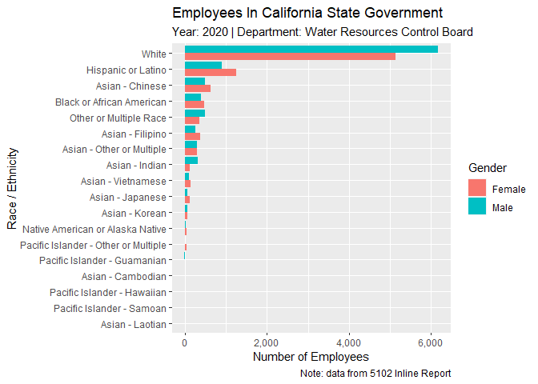

Example Report - State Water Resources Control Board Employment Data
================
Updated: 2021-03-24

-   [Introduction](#introduction)
-   [Including Code](#including-code)
-   [Including Plots](#including-plots)

## Introduction

This is an example R Markdown document (in a format used for publishing
markdown documents to GitHub - when you click the **Knit** button all R
code chunks are run and a markdown file (.md) suitable for publishing to
GitHub is generated).

This example analyzes the demographics of the California State Water
Resources Control Board’s workforce, using data from [CalHR’s Statewide
5102 report](https://www.calhr.ca.gov/pages/statewide-reports.aspx). A
cleaned and compiled version of that data is available on the California
Open Data Portal,
[here](https://data.ca.gov/dataset/calhr-civil-rights-data-for-gare-capital-cohort-2019).

## Including Code

You can include R code in the document as follows:

``` r
# import data ---------------
df_5102_report <- read_csv(file = here('03_data_processed',
                                       'calhr_5102_statewide_2011-2020.csv.gz'),
                           col_types = cols(.default = col_character())) %>% 
    type_convert() %>% 
    clean_names()

# add a column for the year
df_5102_report <- df_5102_report %>% 
    mutate(report_year = year(as_of_date))

# view a summary of the dataset
glimpse(df_5102_report)
```

    ## Rows: 533,900
    ## Columns: 12
    ## $ as_of_date        <date> 2011-12-01, 2011-12-01, 2011-12-01, 2011-12-01, 201~
    ## $ dept              <chr> "Administrative Law, Office of", "Administrative Law~
    ## $ employee_category <chr> "Legal Occupations", "Legal Occupations", "Office an~
    ## $ sub_category      <chr> "Paralegals and Legal Assistants", "Paralegals and L~
    ## $ soc_code          <chr> "23-2011", "23-2011", "43-9061", "43-9061", "13-1111~
    ## $ scheme_code       <chr> "JY62", "JY62", "CA52", "CA52", "JY20", "JY20", "KG3~
    ## $ class_code        <chr> "5237", "5237", "1379", "1379", "5157", "5157", "535~
    ## $ class_title       <chr> "LEGAL ANALYST", "LEGAL ANALYST", "OFFICE ASSISTANT ~
    ## $ identity_variable <chr> "Asian - Chinese", "Asian - Chinese", "Asian - Other~
    ## $ gender            <chr> "Female", "Male", "Female", "Male", "Female", "Male"~
    ## $ record_count      <dbl> 0, 1, 1, 0, 2, 0, 1, 0, 2, 2, 1, 5, 1, 0, 1, 0, 1, 0~
    ## $ report_year       <dbl> 2011, 2011, 2011, 2011, 2011, 2011, 2011, 2011, 2011~

## Including Plots

You can also embed plots, for example (note that the `echo = FALSE`
parameter was added to the code chunk to prevent printing of the R code
that generated the plot):

<!-- -->
